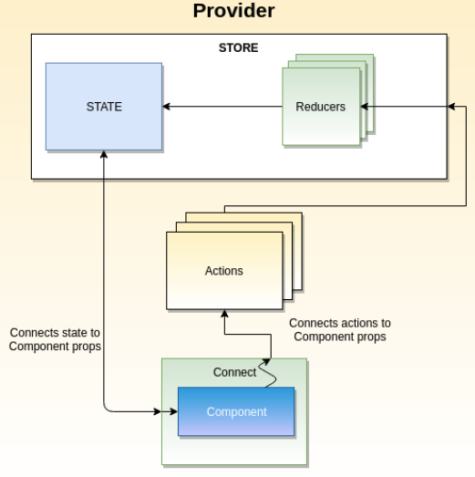

# Redux

If you have components that are siblings and need to share data, the way to do that in React is to pull that data up into a parent component and pass it down with props.

That can be cumbersome though. Redux can help by giving you one global “parent” where you can
store the data, and then you can connect the sibling components to the data with React-Redux.



Redux does some other cool stuff too, like make debugging easier (Redux DevTools let you inspect
every single state change), time-travel debugging (you can roll back state changes and see how your
app looked in the past), and it can make your code more maintainable in the long run.

Some general rules of how Redux handles state:

  - State is read-only, and actions are the only way to modify it.
  - Changes happen one way, and one way only: dispatch(action) -> reducer -> new state.
  - The reducer function must be "pure" – it cannot modify its arguments, and it can’t have side effects.

## Setup

To setup Redux/React Redux install the two packages:

```
npm install redux react-redux
```

Then create a redux folder inside your ```src``` folder


## Redux store vs state

Redux gives you a store, and let's you keep state in it, and get state out, and respond when the state changes, and that's all it does. 

Be careful in thinking that the "store" and "state" are the same.  Technically, the state is the data, and the store is where it’s kept.

To create a store you also need a reducer.

### Reducers

A reducer is a function that is similar to the <a href="https://developer.mozilla.org/en-US/docs/Web/JavaScript/Reference/Global_Objects/Array/reduce">Array.prototype.reducer()</a> method. The JS reduce() method accepts a callback function which will be called once for each element of the array. The callback function gets called with 2 arguments: the last iteration's result and the current array element. The callback function combines the current item with the previous "total" result and returns the new total. 

The callback function you pass in to reduce could rightfully be called a "reducer" because it reduces a whole array of items down to a single result. 

Redux is basically a fancy version of Array's reduce. A reducer function takes the current state, and a action and returns the new state. So the differnce between a reducer function and Array.prototype.reduce() is that a reducer function "reduce" a set of actions into a single state (instead of an array's items to a single result). WOW. 

The reducer function has another job too. It should return the initial state the first time it’s called. This is sort of like “bootstrapping” your app. It’s gotta start somewhere, right?

The idiomatic way to do that is to define an initialState variable and use the ES6 default argument
syntax to assign it to state.

<strong>Note:</strong> You always want your state to be defined.

Reducer function:

```JS
const initialState = {
   count: 0
};

function reducer(state = initialState, action) {
   console.log('reducer', state, action);
   return state;
}
```

Creating a store:

```JS
import { createStore } from 'redux';

const store = createStore(reducer);
```

### Redux Action

An action is Redux-speak for a plain object with a property called type.

```JS
{
  type: "ADD ITEM",
  item: "Sleep"
}

// OR

{
    type: "INCREMENT"
}
```

Redux users usually give our actions types that are plain strings, and often uppercased, to signify that they’re meant to be constant values.

An ```action``` object describes a change you want to make (like “please increment the counter”) or an event that happenend (like “the request to the server failed with this error”).

Actions, despite their active-sounding name, are inert objects, they don’t do anything on their own. Until we dispatch it. 

### Dispatching an action

The store we created earlier has a built-in function called dispatch. Call it with an action, and Redux will call your reducer with that action (and then replace the state with whatever your reducer returned).

```JS
const store = createStore(reducer);
store.dispatch({ type: "INCREMENT" });
store.dispatch({ type: "DECREMENT" });
```

Every call to dispatch results in a call to your reducer!

### Handle Actions in a Redux Reducer

To make actions actually do something, we need to write some code in the reducer that will inspect
the type of each action and update the state accordingly.

```JS
function reducer(state = initialState, action) {
     console.log('reducer', state, action);
     
     switch(action.type) {
        case 'INCREMENT':
            return {
                count: state.count + 1
            };
        case 'DECREMENT':
            return {
                count: state.count - 1
            };
        case 'RESET':
            return {
                count: 0
            };
        default:
            return state;
    }
}
```

Another thing about reducers is that they must be ```pure functions```. This means that they can’t modify their arguments, and they can’t have side effects.

## react-redux

It's ```react-redux``` that lets you connect pieces of the state to React components. That's right, ```redux``` knows nothing about React at all.

The redux library can be used outside of a React app too. It’ll work with Vue, Angular, and even
backend Node/Express apps.

The ```react-redux``` library comes with 2 things: a component called Provider, and a function
called connect.

By wrapping the entire app with the Provider component, every component in the app tree will be
able to access the Redux store if it wants to.

```JS
import { Provider } from 'react-redux';

const App = () => (
    <Provider store={store}>
        <Counter/>
    </Prover>
```

Now any components (and their children) defined inside the ```<Provider></Provider>``` can access the Redux store.

But, not automatically.

We’ll need to use the ```connect``` function on our components to access the store.

The Provider uses React’s Context feature under the hood.

## Connect the Component to Redux using connect (old way)

To get the state out of Redux store, we need to import the connect function at the top of the compoment:

```JS
import { connect } from 'react-redux';
```

As the first argument passed in to connect, mapStateToProps is used for selecting the part of the data from the store that the connected component needs. It’s frequently referred to as just mapState for short.

  - It is called every time the store state changes.
  - It receives the entire store state, and should return an object of data this component needs.

It should take a first argument called state, optionally a second argument called ownProps, and return a plain object containing the data that the connected component needs.

```JS
function mapStateToProps(state) {
   return {
      count: state.count
   };
}
```

Before Redux we export the component itself but now we’re wrapping it with this connect function call, so we’re exporting the connected Counter component. As far as the rest of your app is concerned, this looks like a regular component.

```JS
export default connect(mapStateToProps)(Counter);
```

The connect is a higher-order function that takes two functions as parameters and returns a function that wraps the compoment.

The two functions it takes as paramters are:
  - mapStateToProps
  - mapDispatchToProps

### Currying and closure

The reason you have the two parenthesis ()() is because of ```currying```. Currying is the process in functional programming that transforms a function with multiple arguments into a sequence of nesting functions. It returns a new function that expects the next argument inline.

```JS
function multiply(a, b) {
  return a * b;
}
// Usually we will call the above function as multiply(1, 2)
// We can re-write it using a closure and execute it using currying: 
function multiply(a) {
  return (b) => {
    return a * b;
  }
}
console.log(multiply(1)(2));
// as opposed to separately:
const a = multiply(1) // => function(b) return 1 * b
const product = a(2);
```

## Redux Alternatives

Under the hood, React-Redux uses React’s built-in Context API to pass data around. If you want to,
you can cut out the middleman and use Context directly. You’ll miss out on the nice features of Redux, but if your app is simple and you want an easy way to pass data around, Context might be perfect.

