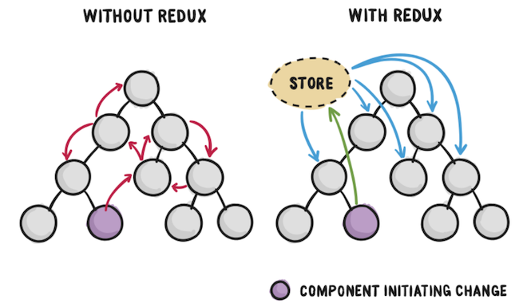
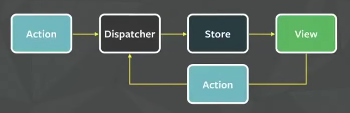

# State Management

State management in web applications has become a popular topic. Since single page applications (SPAs) are only delivered once from a web server yet stay interactive on the client they have to establish state management on the client. 

They have to keep the state consistent in the frontend application without making any more requests to the backend application. They have to give the user an effortless and pleasant experience when using the application.

In React, data flows unidirectionally. This means that we can only pass data from a parent to a child component. This can become a hassle and pretty complex when we start dealing with very large scaled applications.



The Facebook development created the <a href="https://www.youtube.com/watch?v=pR4A9YONzuo">Flux architecture pattern</a> back in <a href="https://www.youtube.com/watch?v=nYkdrAPrdcw">2014</a> as an alternative to MVC architecture. The Flux architecture is based on the following components:

- Store/ Stores: Serves as a container for the app state & logic
- Action: Enables data passing to the dispatcher
- View: Same as the view in MVC architecture, but in the context of React components
- Dispatcher – Coordinates actions & updates to stores



The ```view``` is basically the component tree in a modern application. A user can interact with the View in order to trigger an ```action```(e.g. a click on a button). An Action would encapsulate all the necessary information to update the state in the ```store```. Then, the ```dispatcher``` on the way delegates the Actions to the Store. The new state would be propagated from the Store to the View to update them. The last part closes the loop of the unidirectional data flow.

# React and Redux

Redux is a predictable state container for JavaScript apps. You want the ```state``` of your application to be managed by Redux.

So why is it called Redux? Because it combines the two words Reducer and Flux. 

Some general rules of how Redux handles state:

  - State is read-only, and actions are the only way to modify it.
  - Changes happen one way, and one way only: dispatch(action) -> reducer -> new state.
  - The reducer function must be "pure" – it cannot modify its arguments, and it can’t have side effects.

## Action

An action in Redux is a JavaScript object. It has a type and an optional payload. The type is often referred to as action type. While the type is a string literal, the payload can be anything from a string to an object.

```JS
{
  type: 'TODO_ADD',
  todo: { id: '0', name: 'learn redux', completed: false },
}
```

Executing an action is called ```dispatching``` in Redux. You can dispatch an action to alter the state in the Redux store. You only dispatch an action when you want to change the state. The dispatching of an action is triggered in your view. 

## Reducer(s)

The view dispatches an action, an action object with action type and optional payload, which passes through all reducers. What's a reducer? 

A ```reducer``` is a pure function. It always produces the same output when the input stays the same. It has no side-effects, thus it is only an input/output operation. A reducer has two inputs: state and action. The state is always the global state object from the Redux store. The action is the dispatched action with a type and optional payload. The reducer reduces - that explains the naming - the previous state and incoming action to a new state.

A reducer is a function that is similar to the <a href="https://developer.mozilla.org/en-US/docs/Web/JavaScript/Reference/Global_Objects/Array/reduce">Array.prototype.reducer()</a> method. The JS reduce() method accepts a callback function which will be called once for each element of the array. The callback function gets called with 2 arguments: the last iteration's result and the current array element. The callback function combines the current item with the previous "total" result and returns the new total. 

The callback function you pass in to reduce could rightfully be called a "reducer" because it reduces a whole array of items down to a single result. 

A reducer function takes the current state, and a action and returns the new state. So the differnce between a reducer function and Array.prototype.reduce() is that a reducer function "reduce" a set of actions into a single state (instead of an array's items to a single result). 

The reducer function has another job too. It should return the initial state the first time it’s called. This is sort of like “bootstrapping” your app. It’s gotta start somewhere, right?

The idiomatic way to do that is to define an initialState variable and use the ES6 default argument
syntax to assign it to state.

```JS
const initialState = {
   count: 0
};

function reducer(state = initialState, action) {
  switch(action.type) {
    case 'TODO_ADD' : {
      return state.concat(action.todo);
    }
    case 'TODO_TOGGLE' : {
      return state.map(todo =>
        todo.id === action.todo.id
          ? {...todo, completed: !todo.completed }
          : todo
      );
    }
    default : return state;
  }
}
```

## Store

Redux gives you a store, and let's you keep state in it, and get state out, and respond when the state changes, and that's all it does. 

Be careful in thinking that the "store" and "state" are the same.  Technically, the state is the data, and the store is where it’s kept.

```JS
import { createStore } from 'redux';
```

Now you can use it to create a store singleton instance. The createStore function takes one mandatory argument: a reducer. 

```JS
const store = createStore(reducer);
```

In addition, the createStore takes a second optional argument: the initial state. 

```JS
onst store = createStore(reducer, []);
```

### Dispatching an action

The store we created has a built-in function called dispatch. Call it with an action, and Redux will call your reducer with that action (and then replace the state with whatever your reducer returned).

```JS
const store = createStore(reducer);
store.dispatch({
  type: 'TODO_ADD',
  todo: { id: '0', name: 'learn redux', completed: false },
});
```

Every call to dispatch results in a call to your reducer!


### Handle Actions in a Redux Reducer

To make actions actually do something, we need to write some code in the reducer that will inspect
the type of each action and update the state accordingly.

```JS
function reducer(state = initialState, action) {
     console.log('reducer', state, action);
     
     switch(action.type) {
        case 'INCREMENT':
            return {
                count: state.count + 1
            };
        case 'DECREMENT':
            return {
                count: state.count - 1
            };
        case 'RESET':
            return {
                count: 0
            };
        default:
            return state;
    }
}
```

Another thing about reducers is that they must be ```pure functions```. This means that they can’t modify their arguments, and they can’t have side effects.

## React and Redux: Connect State to React Compoments

To setup Redux/React Redux install the two packages:

```
npm install redux react-redux
```

It's ```react-redux``` that lets you connect pieces of the state to React components. That's right, ```redux``` knows nothing about React at all.

The redux library can be used outside of a React app too. It’ll work with Vue, Angular, and even
backend Node/Express apps.

The ```react-redux``` library comes with 2 things: a component called <a href="https://react-redux.js.org/api/provider">Provider</a>, and a function called <a href="https://react-redux.js.org/api/connect">connect</a>.

By wrapping the entire app with the Provider component, every component in the app tree will be
able to access the Redux store if it wants to.

```JS
import { Provider } from 'react-redux';

const App = () => (
    <Provider store={store}>
        // ...compoments
    </Prover>
```

Now any components (and their children) defined inside the ```<Provider></Provider>``` can access the Redux store.

But, not automatically.

We’ll need to use the ```connect``` function on our components to access the store.

The Provider uses React’s Context feature under the hood.

### Connect function

To get the state out of Redux store, we need to import the connect function at the top of the compoment:

```JS
import { connect } from 'react-redux';
```

As the first argument passed in to connect, mapStateToProps is used for selecting the part of the data from the store that the connected component needs. It’s frequently referred to as just mapState for short.

  - It is called every time the store state changes.
  - It receives the entire store state, and should return an object of data this component needs.

It should take a first argument called state, optionally a second argument called ownProps, and return a plain object containing the data that the connected component needs.

```JS
function mapStateToProps(state) {
   return {
      count: state.count
   };
}
```

Before Redux we export the component itself but now we’re wrapping it with this connect function call, so we’re exporting the connected Counter component. As far as the rest of your app is concerned, this looks like a regular component.

```JS
export default connect(mapStateToProps)(Counter);
```

The connect is a higher-order function that takes two functions as parameters and returns a function that wraps the compoment.

The two functions it takes as paramters are:
  - mapStateToProps
  - mapDispatchToProps

### Currying and closure

The reason you have the two parenthesis ()() is because of ```currying```. Currying is the process in functional programming that transforms a function with multiple arguments into a sequence of nesting functions. It returns a new function that expects the next argument inline.

```JS
function multiply(a, b) {
  return a * b;
}
// Usually we will call the above function as multiply(1, 2)
// We can re-write it using a closure and execute it using currying: 
function multiply(a) {
  return (b) => {
    return a * b;
  }
}
console.log(multiply(1)(2));
// as opposed to separately:
const a = multiply(1) // => function(b) return 1 * b
const product = a(2);
```

## Debugging


## Redux Alternatives

Under the hood, React-Redux uses React’s built-in Context API to pass data around. If you want to,
you can cut out the middleman and use Context directly. You’ll miss out on the nice features of Redux, but if your app is simple and you want an easy way to pass data around, Context might be perfect.

